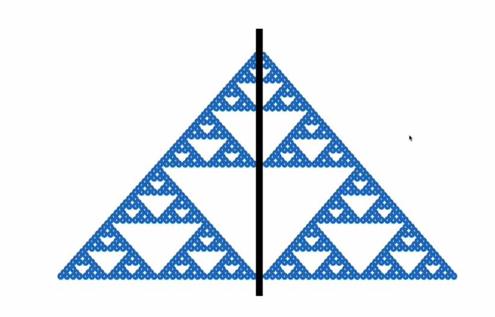
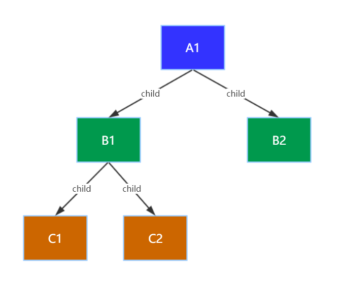
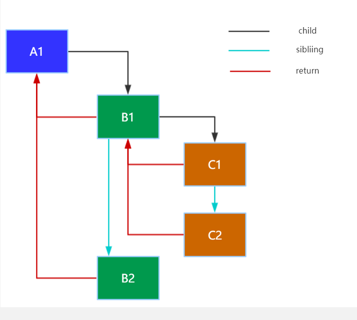
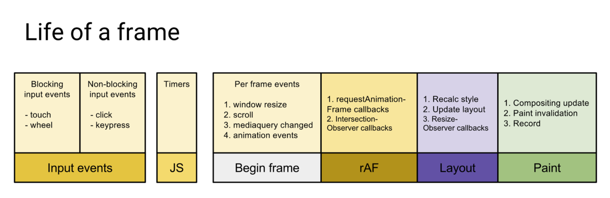
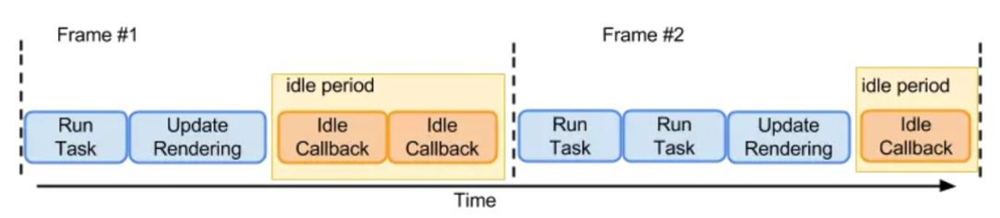

# MayReactV16

一直对ReactV16的实现很好奇,就想自己写一写,分享下对React16设计的理解:

### ReactV15与V16什么区别
    React大概可以分为两个阶段:
        调和阶段(Reconciler):React自顶向下递归,遍历node生成React Tree,Diff阶段找到变更node放入更新队列

        渲染阶段(Renderer):遍历更新队列，通过调用宿主环境的API，实际更新渲染对应元素。宿主环境，比如 DOM、Native、WebGL 等;
    
    V15处理方式:
        简单来说就是递归,所以React15的算法也被称为Stack Reconciler;这种方式有一个特点:
        一旦任务开始就很难中断,js将一直占用主线程可能会阻塞其它工作,导致掉帧;
    

    
    鉴于以上问题V16要解决这些问题其目标是:

        pause work and come back to it later(任务可中断)
        assign priority to different types of work(优先级调度)
        reuse previously completed work(任务可复用)
        abort work if it‘s no longer needed(任务可中止)

        一句话：增量渲染,时间分片（任务可拆分，可匀到多帧）那么如何达到这个目的？

    先看下ReactV15的实现
``` javascript
            class A {
                ...
                render() {
                    return [
                        React.createElement(
                            'div', {
                                key: 'B1'
                            },
                            'C1',
                            'C2'
                        ),
                        React.createElement(
                            'div', {
                                key: 'B2'
                            }
                        )
                    ]
                }
            }
```
    最后渲染成树形结构如下：


    很直观就是我们常见的树形结构,遍历起来也很方便,深度优先遍历就可以了;

    那我们简单实现一下V15的遍历:

``` javascript
        let a1_15 = {
            name: 'a1_15',
            render: () => { return [b1_15, b2_15] }
        };
        let b1_15 = {
            name: 'b1_15',
            render: () => { return [{ name: 'c1_15' }, { name: 'c2_15' }] }
        };
        let b2_15 = {
            name: 'b2_15',
            render: () => { return '' }
        };

        walk(a1_15);

        function walk(instance) {
            doWork(instance);
            if (instance.render) {
                const children = instance.render();
                children && children.forEach(walk);
            }
        }

        function doWork(o) {
            console.log('V15Loop', o.name);
        }
```
    大家可以在浏览器log一下这里就不粘结果了就是很简单的深度优先(DFS)遍历,可以理解为栈结构(Stack 后进先出)。
    V15当时实现这种树形遍历很直观也很方便理解,但是也带来了一些问题,最大的问题就是很难中断:

        一旦任务开始就很难中断,js将一直占用主线程可能会阻塞其它工作,导致掉帧;
        如果要中断，执行其它任务再返回继续，我们需要重新建立栈结构，每次中断返回我们都需要解绑和重建栈结构，
        更麻烦的是栈相关的信息我们都要有解绑的意识，代码越多越难维护；

    所以为了解决这个问题React团队对15进行了重构,寻找一种解决方案这个解决方案就是ReactV16的React Fiber架构,
    那么Fiber要怎么设计怎么实现呢?

        先总结下V15问题:
            1.如何增量更新？不能把现有node统一为一致的任务单元
            2.很难中断，任务执行时间过长可能会导致掉帧，中断之后如何继续？
            3.无法复用
        React团队给出的方案:
            增量渲染，时间分片（任务可拆分，可匀到多帧）
            1.我们需要先把渲染任务分解为统一的工作单元(unit of work)。
            从这个角度讲：Fiber就是最小的任务分片，一个Fiber Node就是一个渲染任务

            2.Node结构要怎么设计，我们需要遍历，并且支持中断，可复用。

            3.支持时间分片，支持优先级调度。

    Fiber要如何设计?
        首先我们需要先把渲染任务分解为统一的工作单元(unit of work)，需要遍历,之前是很直观的树形结构深度遍历,
        但是这种方式很难中断,所以React团队提出了一种新型的数据结构链表结构现在我们看一下是如何实现的;


``` javascript

        class Node {

            constructor(instance) {
                this.instance = instance;
                this.child = null;
                this.sibling = null;
                this.return = null;
            }

        }

``` 
    相比之前的树形结构,Fiber新加了三个字段child,sibling,return来分别指向其子节点,兄弟节点,父级节点,
    那么其生成的树又是什么样的呢,我们来看一下




    可以看的和15的树形结构不同,Fiber采用的是链表结构那么应该如何实现遍历呢,我们简单实现一下:

``` javascript
        let a1 = { name: 'a1_16', child: null, sibling: null, return: null };
        let b1 = { name: 'b1_16', child: null, sibling: null, return: null };
        let b2 = { name: 'b2_16', child: null, sibling: null, return: null };
        let c1 = { name: 'c1_16', child: null, sibling: null, return: null };
        let c2 = { name: 'c2_16', child: null, sibling: null, return: null };
        a1.child = b1;
        b1.sibling = b2;
        b1.child = c1;
        c1.sibling = c2;

        b1.return = b2.return = a1;
        c1.return = c2.return = b1;

        let nextUnitOfWork = a1;
        workLoop();

        function workLoop() {
            while (nextUnitOfWork !== null) {
                nextUnitOfWork = performUnitOfWork(nextUnitOfWork);
            }
        }

        function performUnitOfWork(workInProgress) {
            let next = beginWork(workInProgress);
            if (next === null) {
                next = completeUnitOfWork(workInProgress);
            }
            return next;
        }

        function beginWork(workInProgress) {
            log('work performed for ' + workInProgress.name);
            return workInProgress.child;
        }

        function completeUnitOfWork(workInProgress) {
            while (true) {
                let returnFiber = workInProgress.return;
                let siblingFiber = workInProgress.sibling;

                nextUnitOfWork = completeWork(workInProgress);

                if (siblingFiber !== null) {
                    return siblingFiber;
                } else if (returnFiber !== null) {
                    workInProgress = returnFiber;
                    continue;
                } else {
                    // We've reached the root.
                    return null;
                }
            }
        }

        function completeWork(workInProgress) {
            return null;
        }

        function log(message) {
            console.log('V16Loop', message);
        }

``` 
    结果就不贴了,大家可以在浏览器自己log下,其实也是深度优先遍历和15是一样的;
    其实可以这样说V15是很直观也很容易理解的栈遍历(Stack),V16链表结构实现的也是一种栈的效果,
    我们可以称它为一种虚拟栈(Virtual Stack),区别在于V15的遍历一开始就很难中断,
    而链表的循环我们可以一直保持对顶部栈帧的引用(我们的nextUnitOfwork),
    即便中断之后再回来也可以从中断的地方开始,这样我们就实现了设想的任务可中断功能;

    那么Fiber如何实现时间分片和任务可复用功能呢?

        我们先看一下浏览器每一帧都要做哪些工作:


        分别是处理用户的交互, JS 解析执行,帧开始。rAF，布局,和渲染
        而我们常说的60FPS不卡是什么意思呢:就是1s 60 帧，所以每一帧分到的时间是 1000/60 ≈ 16 ms。
        就是16ms内渲染完一帧画面就会很流畅不会卡顿,而V15因为遍历一但开始就很难中断,
        如果一次任务执行时间超过16ms了就会导致页面渲染掉帧就会卡顿;

        那么V16如何解决这个问题呢?
        答案就是浏览器新推出的requestIdleCallback API
        我们看下requestIdleCallback API的定义



        requestIdleCallback：上面六个步骤完成后没超过 16 ms，说明时间有富余，
        此时就会执行 requestIdleCallback 里注册的任务。

        那我们要做的时间分片是什么呢?
            时间分片：把渲染更新过程拆分成多个子任务，每次只做一小部分，做完看是否还有剩余时间，
            如果有继续下一个任务；
            如果没有，挂起当前任务，将时间控制权交给主线程，
            等主线程不忙的时候在继续执行；其实这是操作系统的调度策略之一叫Cooperative Scheduling（合作式调度）;

        之前的链表结构我们已经可以实现任务中断,已经知道可以通过requestIdleCallback API来实现时间分片,
        每次执行一部分任务,有紧急任务先挂起,不忙了再继续执行,
        那么如何实现呢?
        我们先看下requestIdleCallback API解释:

``` javascript

    requestIdleCallback((deadline)=>{

        //timeRemaining当前帧剩余的时间，也可理解为留给任务的时间还有多少
        //didTimeout表示任务是否超时
        console.log(deadline.timeRemaining(), deadline.didTimeout)

    });

```
    和我们的链表循环结合之后大概是这样子:

``` javascript

    requestIdleCallback((deadline) => {

        // while we have time, perform work for a part of the components tree
        while ((deadline.timeRemaining() > 0 || deadline.didTimeout) && nextUnitOfWork) {
            nextUnitOfWork = performUnitOfWork(nextUnitOfWork);
        }

    }); 

```
    应该比较明显了,浏览器当前帧有空闲的时候执行我们的渲染任务,没有空闲则执行其它任务,
    中断之后可以继续执行(nextUnitOfWork永远是当前栈顶部栈帧的引用,保证我们中断后再回来还是之前的任务)

    那么React是如何写的呢?

``` javascript

    function workLoop() {

        while (nextUnitOfWork !== null&& !shouldYield()) {
            nextUnitOfWork = performUnitOfWork(nextUnitOfWork);
        }

    }

```
    我们可以看的没有直接使用requestIdleCallback
    因为requestIdleCallback在浏览器是有执行频率限制的

        requestIdleCallback is called only 20 times per second - Chrome on my 6x2 core Linux machine, it‘s not really useful for UI work；
        requestIdleCallback有频次限制，所有React团队自己实现了一个类似方法在源码的Scheduler.js
    
    这样Fiber就实现了任务中断和任务匀到多帧渲染解决V15的掉帧问题
    (当然如果你硬要在一帧之中搞事情,执行超过16ms的操作React也是无能为力也会掉帧的,
    React只保证大部分情况下提供流畅的渲染)

    那么Fiber如何实现任务复用呢?

    Render阶段：React在第一次渲染时，会通过React.createElement创建一颗Element Tree, 
    v16为了增量更新，拆分任务为一个个单元，我们引入了Fiber Node，
    在render阶段FiberNode也通过链表结构形成了一个Fiber Tree，
    链表结构循环我们可以一直保持顶部栈帧的引用，配合requestIdleCallback API, 实现任务拆分、中断与恢复;
    
    commit阶段：第一次render直接渲染Fiber Tree到屏幕，React称它为current树（反应当前UI的状态）；

    Diff阶段的 React引入了双缓存（Double Buffering）技术，React会构建另一颗WorkInProgressTree；

    好处：能够复用内部对象（fiber），节省内存分配、GC的时间开销，就算运行中有错误，也不会影响 View 上的数据

    可以理解为Git 功能分支，分支出错也不影响master，分支测试完善后再替换master

    ReactFiber的设计思想,就先介绍到这里了,希望对大家有一些帮助,大家有觉得不对的地方也恳请大家指正,
    render和Diff的具体过程会复杂一些,后续会更新出来,大家有时间可以尝试自己实现下V16的实现,
    可以参照我另一个V15实现的过程自己写一下,会很难也会很耗费时间但是会有很大的收获.

    路漫漫其修远兮,愿你我都能孜孜以求。


    


